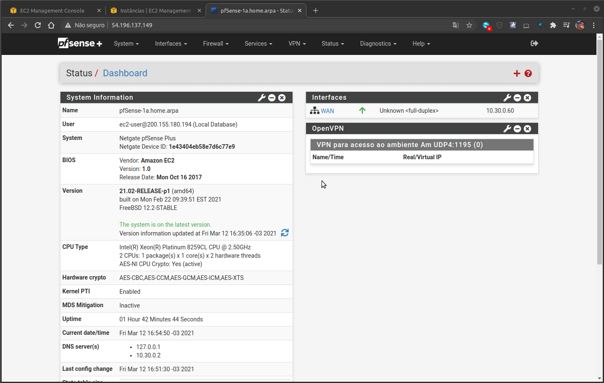
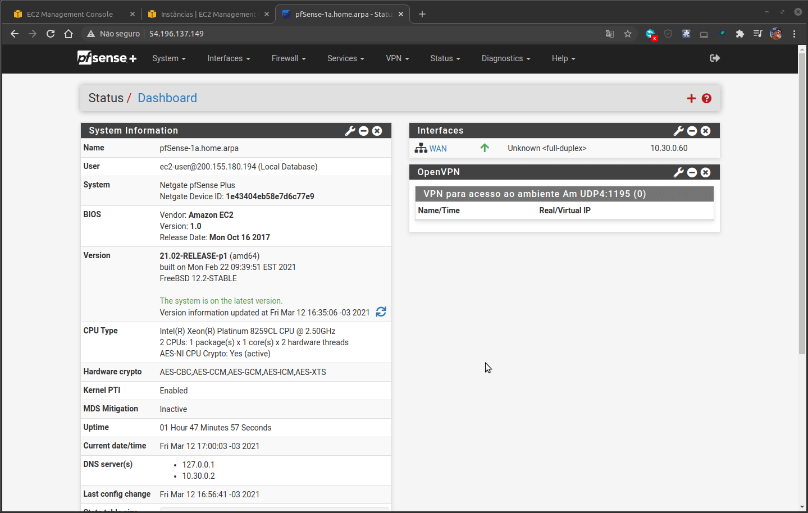

# Modulo de PfSense para Terraform
Esse modulo visa a criação de VPN usando Pfsense com Terraform

### Subindo a instancia do Pfsense
No seu terminal digite os seguintes comandos nessa ordem
- Terraform init
- Terraform plan
- Terraform apply

## Configuração do PfSense
Para configuração do Pfsense criamos o manual abaixo visando facilitar sua aplicação, configuração e utilização

### Capturando Usuario e senha do PfSense
Como primeiro passo é necessario verificarmos o usuario e senha criados para o primeiro do pfSense, siga o gif abaixo para coleta:

### Primeiro acesso
Para fazer o primeiro acesso a instancia o PfSese siga os passos abaixo:

### Ativando Aceleração de Hardware
Apos o primeiro acesso é necessario ativar a aceleração de hardware para otimizar a rede

### Instalando o Pacote de Exportação de Cliente
Para inicio das configurações do PfSense é necessario a instalação do pacote de exportação

### Configurando OpenVpn no PfSense
Siga os passos abaixo para inicio das configurações da OpenVpn no Pfsense

### Criando Usuario no PfSense para Acesso a OpenVpn
Siga os passos abaixo para criação de usuarios

